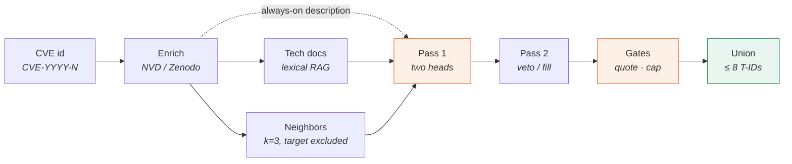
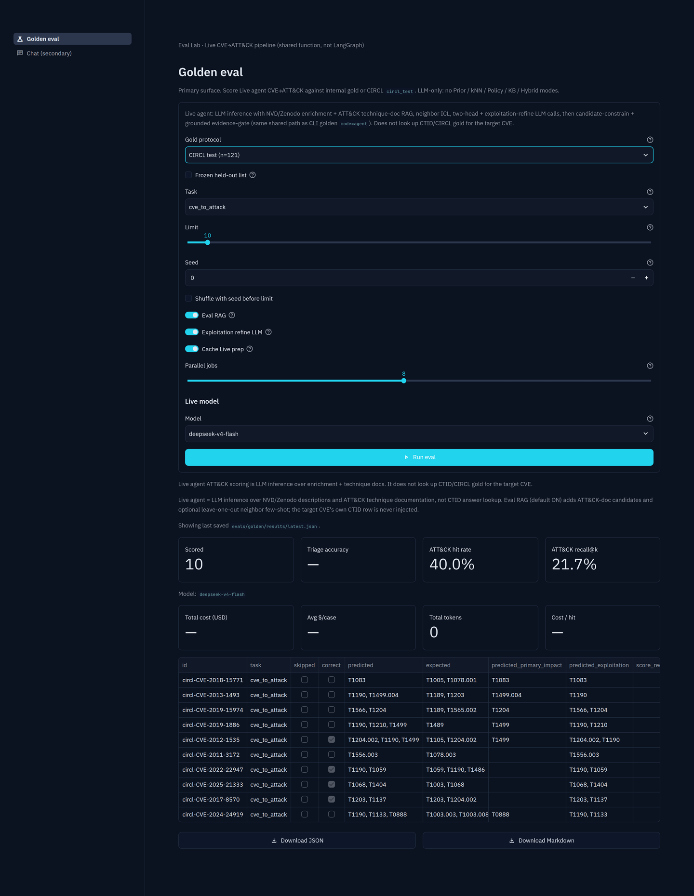
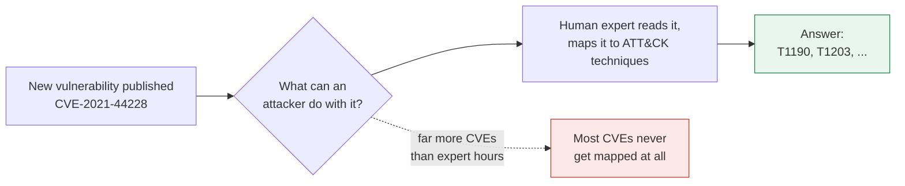
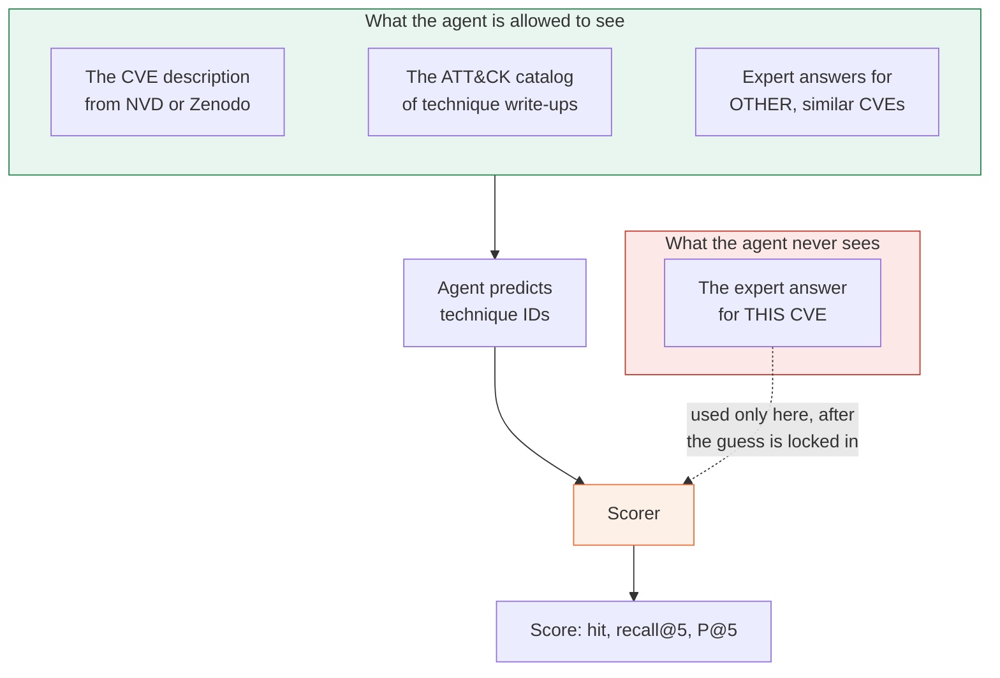
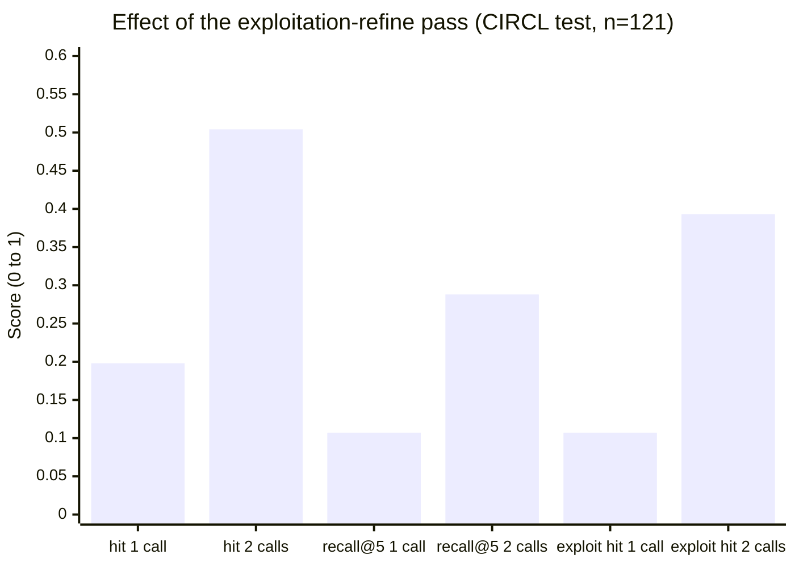
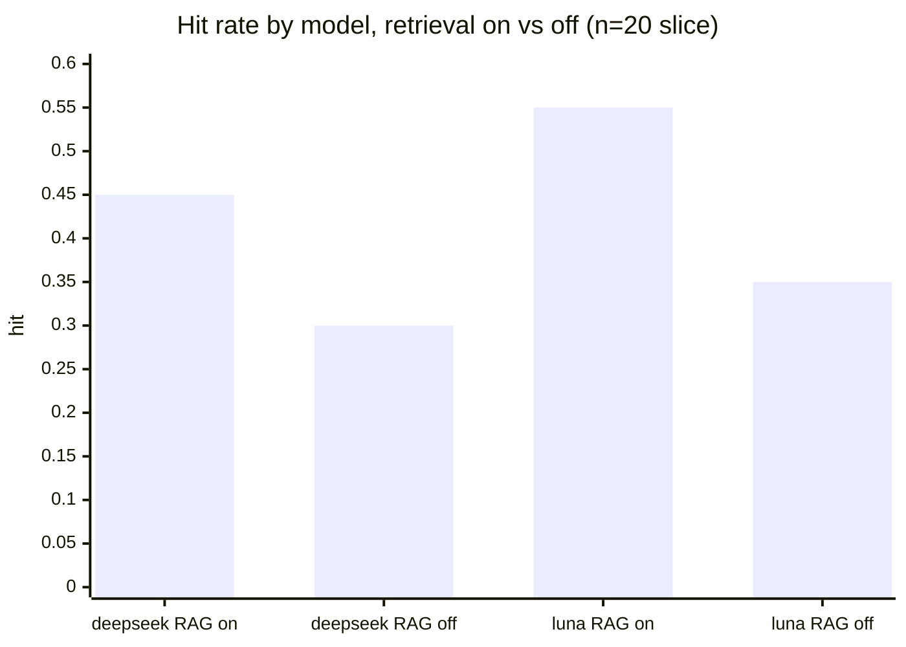
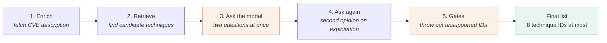

# CVE-to-ATT&CK Eval Agent

A Live LLM pipeline that maps a CVE to MITRE ATT&CK techniques and scores itself against CIRCL held-out gold. The stages are enrich, tech-doc RAG + neighbor ICL, two-head predict, exploit-refine, and deterministic gates. It ships with a Streamlit Eval Lab and FastAPI/CLI demos.

The of-record path is one shared function, `evals.golden.live_attack.predict_cve_to_attack`, called by Eval Lab, the CLI runner, and Chat. No agent framework sits behind it, LangGraph included. `src/agent/graph.py` is a single JSON chat completion for non-CVE queries.

CIRCL test n=121 · `deepseek-v4-flash` · exploit-refine hit **0.504** (post-hoc, older `pipeline_version`) · HEAD is `pipeline_version=3` and will not reproduce 0.504 · ~$0.02 / full pass · MIT

[](LICENSE)
[](pyproject.toml)
[](https://github.com/bloodlove11/cve2attack/actions)

---

## Results at a glance

CIRCL official test, n=121, `deepseek-v4-flash`. A second LLM pass (exploit-refine) more than doubles hit.

| Pipeline | hit | recall@5 | P@5 | exploit hit | list $ / full pass |
|----------|-----|----------|-----|-------------|-------------------|
| Live (no exploit-refine) | 0.198 | 0.107 | 0.161 | 0.107 | ~$0.01 |
| Live (+ exploit-refine) | **0.504** | **0.288** | 0.284 | **0.393** | **~$0.02** |

> 0.504 is a post-hoc ablation on the frozen CIRCL test list: the gates, the refine step, and the retrieval priors were all tuned on errors from that same list. The artifacts also predate the current pipeline, from a version before ICS and mobile technique IDs were stripped and while retrieved snippets could still ground a quote. HEAD is `LIVE_PIPELINE_VERSION = "3"` (`evals/golden/live_attack.py`) and won't reproduce 0.504. Treat the table as a frozen historical artifact, not current skill, and don't mix partial Qwen runs into it. If you're citing a number, cite [`docs/EVAL_REPORT.md`](docs/EVAL_REPORT.md) instead.

`hit` = at least one technique right. `recall@5` = fraction of expert techniques found. `P@5` = fraction of the agent's named techniques that were correct (`hits / len(pred[:5])` over variable-length lists, which is not CIRCL's ranking P@5). The repo never reports a blended "accuracy."

List $ uses ExperientialLabs catalog rates × measured tokens; the gateway's reported `usage.cost` was often $0 during a promotion.

Model × RAG grid (n=20, comparative only, and too small to be of record): DeepSeek RAG on hit 0.450 / off 0.300; Luna RAG on 0.550 / off 0.350. Full tables below.

---

## What it looks like



Eval Lab, CLI, and Chat all call the same shared pipeline (`evals.golden.live_attack.predict_cve_to_attack`).



_Streamlit Eval Lab (`Golden eval`) set to CIRCL official test and Limit 10. The scored table is the first 10 rows of the published Live artifact `evals/golden/published/circl_test_live_refine.json`, loaded offline — not a HEAD rerun, and not the n=121 0.504 figure above. Cost is blank because that JSON has no provider usage._

---

## Quick start

Python 3.11+. Without an API key you can still run the unit tests.

```bash
python -m venv .venv && source .venv/bin/activate
cp .env.example .env          # set EXPLABS_API_KEY for Live runs
pip install -e ".[ui,dev]"
pytest -q                     # no key needed
streamlit run src/ui/app.py   # http://localhost:8501  (Eval Lab)
```

`ui` = Eval Lab + secondary Chat. `circl` = pandas/pyarrow for CIRCL parquet gold. CLI-only: `pip install -e ".[dev]"`. Full protocol: [`docs/EVAL_PROTOCOL.md`](docs/EVAL_PROTOCOL.md).

---

## The problem

When a new software flaw is found, it gets a public ID like `CVE-2021-44228`. That ID tells you a flaw exists. It does not tell you what an attacker can actually *do* with it.

Security teams answer that second question by mapping the flaw onto [MITRE ATT&CK](https://attack.mitre.org/), a public catalog of attacker behaviors (`T1190` = "exploit a public-facing application"). That mapping is expert work, it is slow, and there is far more of it to do than there are experts.

This project asks a language model to do the mapping, then spends most of its effort on two questions: how often is the model right, and what does being right cost?



You give the agent a CVE identifier. It returns at most eight ATT&CK technique IDs, plus the CVE-description quote it used as justification.

```bash
python -m src.main "Map CVE-2021-44228 to MITRE ATT&CK techniques"
```

That single-question path is a demo. The main surfaces are the Eval Lab and the golden eval runner.

---

## Why honest measurement is the hard part

Public datasets exist where experts have already mapped CVEs to techniques. Those are the answer key, called **gold**. If the agent can look up the CVE it's being asked about, it will score perfectly and tell you nothing about how good it actually is, so this repo goes out of its way to keep that from happening.



Gold labels are scoring-only. Neighbor examples come from a separate training pool, and the target CVE's own ID is excluded by force. That is what "Live" means: a run where the model had to guess.



Each metric appears twice: first with one LLM call per CVE, then with two. The second call roughly doubles the bill, from about one cent to about two cents for all 121 vulnerabilities.

### Which model, and does retrieval help?

Same 20 test CVEs, exploit-refine on. "RAG on" means neighbor examples plus ATT&CK-doc retrieval. "RAG off" is `--no-rag`: no neighbor few-shot, though technique-doc candidates still appear in the prompt.



| model | RAG | hit | recall@5 | P@5 | list $/case | list ×121 |
|-------|-----|----:|---------:|----:|------------:|----------:|
| `deepseek-v4-flash` | on | 0.450 | 0.241 | 0.300 | **$0.00016** | **~$0.02** |
| `deepseek-v4-flash` | off | 0.300 | 0.198 | 0.217 | $0.00013 | ~$0.02 |
| `gpt-5.6-luna` | on | **0.550** | **0.291** | **0.425** | $0.00144 | ~$0.17 |
| `gpt-5.6-luna` | off | 0.350 | 0.198 | 0.325 | $0.00117 | ~$0.14 |
| `qwen3.8-27b` | n/a | *blocked* | n/a | n/a | ~$0.0016* | ~$0.19* |

\*Qwen hit the free $5/day cap on this grid. List $ uses the DeepSeek token mix against Qwen catalog rates. An earlier incomplete CIRCL run (RAG on, n=87) gave hit 0.471 and P@5 0.388.

Retrieval helps both models, by +0.15 hit for DeepSeek and +0.20 for Luna. Luna is the more accurate model on this slice, while DeepSeek costs roughly ten times less for quality that is close behind.

This 20-CVE grid is comparative only. It is too small to be of record.

Deeper write-ups: [`docs/EVAL_REPORT.md`](docs/EVAL_REPORT.md) · cost: [`docs/CIRCL_COST_ACCURACY.md`](docs/CIRCL_COST_ACCURACY.md) · grid: [`docs/CIRCL_MODEL_RAG_COST.md`](docs/CIRCL_MODEL_RAG_COST.md) · errors: [`docs/ERROR_ANALYSIS.md`](docs/ERROR_ANALYSIS.md). Raw artifacts live in `evals/golden/published/`.

### Where it still fails

From [`docs/ERROR_ANALYSIS.md`](docs/ERROR_ANALYSIS.md):

- Without the refine pass, a third of predictions come back empty, because the evidence gate throws out unsupported guesses (33.1% empty, falling to 0.8% with refine).
- With refine, the model over-fires the popular techniques. `T1190` and `T1203` are the top false positives.
- The "what does the attacker gain" head stays weak either way, missing about 84% of the time. Refine specializes in the other head by design.
- These are gating and skill problems, not leakage. The agent never read the target's answer.

---

## How it works, stage by stage

Everything above runs through one shared function, `evals.golden.live_attack.predict_cve_to_attack`, used identically by the Eval Lab, the CLI runner, and Chat. Retrieval and gates filter what the model says; they never substitute for it.



### 1. Enrichment (this is not RAG)

Fetch the CVE's own description, plus CWEs and CVSS when present, from the local Zenodo cache or NVD. This text is the only evidence the gate in step 5 will accept as a quote. Enrichment is always on, and `--no-rag` does not skip it.

### 2. Retrieval

Two channels, both kept away from the target CVE's answer:

| Channel | What it retrieves | Role |
|---------|-------------------|------|
| Tech-doc RAG | Lexical matches in the STIX v19.2 ATT&CK catalog (technique names and descriptions) | Candidate T-IDs and short snippets in the prompt |
| Neighbor ICL | k=3 similar *other* labeled CVEs (CIRCL train pool only under `circl_test`) | Few-shot examples; the target ID is hard-excluded |

`--no-rag` drops neighbor ICL. ATT&CK-doc candidates still appear in the prompt, which is precisely the ablation measured in the n=20 grid above. Candidates are Enterprise-only, so ICS and mobile IDs are stripped.

### 3. Two-head LLM (pass 1)

One chat completion, which must return JSON with two separate answers:

- `exploitation_techniques`: how the vulnerability is abused (RCE, exploit, and so on)
- `primary_impact`: what the attacker ends up with (disclosure, DoS, and so on)

The model may only pick from the candidate set. Five techniques are common enough that a model reaches for them reflexively (`T1190`, `T1203`, `T1059`, `T1055`, `T1068`), so those must arrive with a verbatim quote from the CVE description, not from a retrieved ATT&CK snippet.

### 4. Exploitation-refine (pass 2)

Exploitation is the weaker of the two heads, so a second LLM call reviews the draft. It's limited to two moves: when pass 1 predicted something, it can only remove IDs, never add new ones; when pass 1 came back empty, it can add up to 2.

Turn it off with `--no-exploit-refine` for one LLM call per case. On the of-record CIRCL run, doing that dropped hit from 0.50 to 0.20.

### 5. Gates (deterministic, no model involved)

After both LLM calls:

1. Drop IDs that are not in the candidate list, when candidates exist.
2. Drop the five high-prior techniques when they lack a grounded quote from the CVE description.
3. Apply the refine veto and the cap (`MAX_EXPLOIT_REFINE = 2`).
4. Union both heads, cap the result at 8 T-IDs, and resolve revoked IDs through the ATT&CK catalog.

Only then does the scorer compare that union against CIRCL/CTID gold.

---

## Eval Lab (Streamlit)

The default page when the app launches. A good first Live run:

1. Task `cve_to_attack`, gold CIRCL test (n=121)
2. Model `deepseek-v4-flash` (needs `EXPLABS_API_KEY`)
3. Set a small Limit first, say 10, before committing to the full held-out set

| Page | Role |
|------|------|
| Golden eval | Primary. Live agent, split metrics, cost and tokens. |
| Chat (secondary) | Optional multi-turn demo. CVE-to-ATT&CK still calls the same Live helper. |

---

## CLI evals

There is exactly one evaluation mode and it needs an API key: the Live agent, which never reads the target CVE's CTID/CIRCL gold.

Earlier versions shipped non-LLM predictors (Prior, kNN, Policy, KB, Hybrid). Those were removed, so this is an LLM-only harness now.

Internal gold lives in `evals/golden/golden_dataset.json`, about 110 cases. The headline ATT&CK split is CIRCL `circl_test`, n=121.

```bash
# Headline Live ATT&CK (needs API key; serial for reproducible A/Bs)
python -m evals.golden.runner --mode agent --task cve_to_attack \
  --heldout --protocol circl_test --jobs 1

# Live agent (internal gold smoke)
python -m evals.golden.runner --mode agent --task cve_to_attack --limit 10 --jobs 8
# CIRCL official test — always frozen test IDs (never train). Limit = prefix.
python -m evals.golden.runner --mode agent --task cve_to_attack \
  --protocol circl_test --limit 10 --jobs 1
# Fast CIRCL sweep: more workers, skip exploit-refine (~½ LLM calls), prep cache on
python -m evals.golden.runner --mode agent --task cve_to_attack \
  --heldout --protocol circl_test --jobs 8 --no-exploit-refine
python -m evals.golden.runner --mode agent --task cve_to_attack --limit 10 --no-rag
```

Case parallelism defaults to 8 workers (`GOLDEN_JOBS_CAP`, or **Parallel jobs** in the Eval Lab). Non-LLM prep is cached to disk under `evals/golden/cache/`; disable it with `--no-prep-cache` or `LIVE_PREP_CACHE=0`.

Metrics are always reported split, never blended: `triage.accuracy`, `attack.hit_rate`, `attack.recall_at_k`, plus per-head Live rates when gold provides them. Every run records provider cost and tokens under `metrics.cost`.

```bash
# Compare result JSONs (quality × observed cost/tokens)
python -m evals.golden.cost_benchmark \
  evals/golden/published/circl_test_live_refine.json \
  evals/golden/results/latest.json

# Model × RAG grid (frozen CIRCL prefix; writes docs + published JSON)
python -m evals.golden.model_grid \
  --models deepseek-v4-flash,gpt-5.6-luna,qwen3.8-27b \
  --n 20 --jobs 3 --write-docs
```

Results land in `evals/golden/results/`, which is gitignored. The DeepSeek Live n=20 run (`--heldout` without `--protocol circl_test`) is a smoke test, not of record.

Full protocol: [`docs/EVAL_PROTOCOL.md`](docs/EVAL_PROTOCOL.md). Walkthrough: [`docs/OVERVIEW.md`](docs/OVERVIEW.md).

---

## Where the answer key comes from

Gold labels are public and citable: MITRE CTID, CIRCL on Hugging Face, the Zenodo triage benchmark, and CISA KEV. Nothing is scraped. Full provenance, including pinned dataset revisions, is in [`evals/golden/SOURCES.md`](evals/golden/SOURCES.md).

---

## Secondary surfaces

```bash
python -m src.main "Map CVE-2021-44228 to MITRE ATT&CK techniques"
# Local uvicorn is unauthenticated unless CHAT_REQUIRE_API_KEY=1 (image default)
CHAT_REQUIRE_API_KEY=1 uvicorn src.api.server:app --reload --port 8000 --host 127.0.0.1
docker compose up --build                         # API 127.0.0.1:8000 (key required)
docker compose --profile ui up --build agent-ui   # Streamlit 127.0.0.1:8501
```

Do not expose the FastAPI `/chat` endpoint or the Streamlit app on untrusted networks. Compose and the Docker image default to `CHAT_REQUIRE_API_KEY=1`, host ports bind to `127.0.0.1`, and `/chat` allowlists model ids.

## Env

| Variable | Default | Purpose |
|----------|---------|---------|
| `EXPLABS_API_KEY` | _(required for Live)_ | ExperientialLabs API key. This is the secret, so never commit `.env`. |
| `EXPLABS_BASE_URL` | see `.env.example` | OpenAI-compatible gateway URL. Not secret, just copy it from `.env.example`/Compose rather than guessing a host. |
| `EXPLABS_MODEL` | `deepseek-v4-flash` | Default Live agent model |
| `EXPLABS_OMIT_TEMPERATURE` | _(unset)_ | If `1`/`true`, never send `temperature` |
| `CHAT_API_KEY` | _(optional)_ | Gate FastAPI `/chat` only |

## Layout

```
evals/golden/ # Live agent pipeline, runner, gold, CIRCL, STIX catalog  ← primary
src/ui/       # Eval Lab (default) + secondary Chat
src/          # optional Chat/API/CLI wrappers around the same Live helper
tests/        # unit tests (LLM mocked)
docs/         # eval protocol + walkthrough
```

```bash
pytest -q
```

**License:** MIT for the code ([`LICENSE`](LICENSE)). Eval ground truth is third-party public data, listed in [`evals/golden/SOURCES.md`](evals/golden/SOURCES.md).
